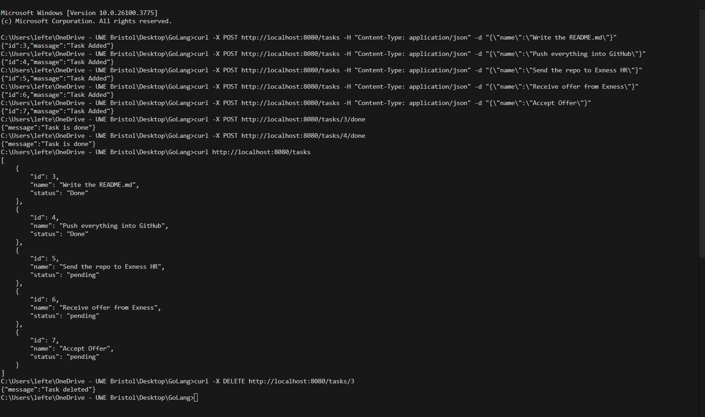

# Task Manager API
This is a tiny task manager RESTful API built with GoLang using Gin Web Framework. It allows you to Add Tasks, Remove Tasks, Display a list with the tasks and their id, name, status and mark tasks as done. 

---


## Features
Add Task - Create a new task
Delete Task - Delete a task from the list
List Tasks - Display a list with the tasks, both done and pending
Delete a Task - Delete a task by giving the task id(You can find the id of each task on the List)

Error Handling - The code supports basic error handling on each function
Code Modularity - The code is fully modular by:
1) Having seperate functions which are all then connected in the setupRoutes function.
2) Having 2 different files, main.go and tasks.go 

## Project Structure

    /screenshots<br>
    go.mod<br>
    go.sum<br>
    main.go<br>
    tasks.go<br>
    README.md<br>
---
## How to Run
1) Install Dependencies:<br>
Make sure you have Go installed and the Gin Framework. If you want to install Gin, simply run on the terminal:<br>
```
go get -u github.com/gin-gonic/gin
```
2) Navigate through terminal on the project directory and run:<br>
```bash
go run main.go tasks.go
```
3) Server will start at http://localhost:8080

##   API Endpoints

| Method | Endpoint          | Description             |
|--------|-------------------|-------------------------|
| POST   | `/tasks`          | Adds a new task         |
| GET    | `/tasks`          | List all tasks          |
| POST   | `/tasks/:id/done` | Mark a task as done     |
| DELETE | `/tasks/:id`      | Delete a task based on the ID|

## Instructions for testing-use

The application is not connected with a database, instead it runs in memory which means that every action is stored only when the application is running. Once the application is closed, all the data are erased.

For this application you need have installed Go Golang, the dependencies (instructions on how to install dependencies are listed above).

1) Run 
```
go run main.go tasks.go
```
2) Open a second terminal while you have the first open and navigate to the project directory
```
- To add a Task, replace the "task name" with your desired name and run: curl -X POST http://localhost:8080/tasks -H "Content-Type: application/json" -d "{\"name\":\"Task Name\"}"

- To display the list with the tasks run: curl http://localhost:8080/tasks

- To remove a Task run: curl -X DELETE http://localhost:8080/tasks/1
You have to replace the integer at the end of the command with the item's id that you want to remove. You can find the id by displaying the list with the tasks


- To mark a task as Done, replace the id in the command with the appropriate id and run: curl -X POST http://localhost:8080/tasks/1/done

- If you want to shut the server, go to the terminal that the application is running and press ctrl+c
```

## Screenshots of Running 



## Resources and Additional Information

- [A tour of go](https://go.dev/tour/welcome/1)
- [Gin framework documentation](https://gin-gonic.com/docs/)
- [Tutorial: Developing a RESTful API with Go and Gin](https://go.dev/doc/tutorial/web-service-gin)
- [JSON handling in Go](https://blog.golang.org/json-and-go)

Note: chatGPT was used for learning on how to convert the project from 1 file(main.go) into 2 different files to achieve modularity. 

I hope the assignment satisfies fully the requirements. Excited to join the Exness team!

Author: Eleftherios Angelos Tsourdiou

